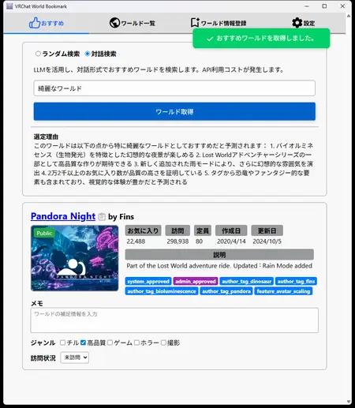
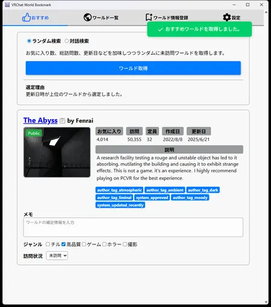
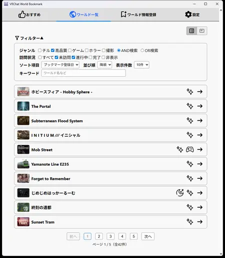
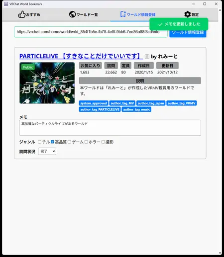
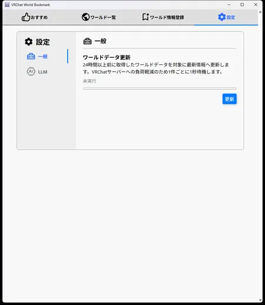
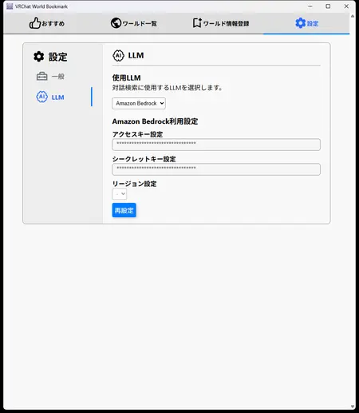

# VRChat World Bookmark

VRChatのワールドブックマークアプリです。
ワールド探索を補助するツールが欲しいと考え作成しました。

ゲーム内のワールドブックマーク機能は以下の課題を抱えていると考えており、本アプリはこれらの課題を解決します。

- ブックマーク数に上限が存在する
  - 100ワールド * 4カテゴリの400が上限
- ジャンル別の管理が難しい
  - 5つ以上の分類が出来ない
- ワールドの探索状況を管理出来ない
  - 行ったことがないワールドを中心にたくさん探索したいといった要求を満たせない
  - 行ったことがあるが、コンテンツを踏破したかどうかといったことも後から正確に把握出来ない
- メモ書きが出来ない
  - どういったワールドかという情報を保存出来ない
- 探索候補から提案をしてくれない
  - 探索候補のワールドからおすすめを1つ選んで提案してくれるといった機能がない

# 主な機能

- ワールド情報の登録
  - 自由入力の可能なメモ、タグ付け、訪問状況
- 登録したワールド情報から条件を指定した抽出
- ワールドおすすめ機能
  - 未探索のワールドからおすすめワールドを提案する機能
  - LLMと連携した対話ベースによるおすすめワールド提案機能
    - LLMを利用するためのアクセスキーはご自身で用意して頂く必要があります。
    - 現状Amazon Bedrockにのみ対応しています

データはPC上の`%APPDATA%\vrc-world-bookmark`配下に保存されます。

# 画面

## おすすめ画面

### LLM検索



### ランダム検索



## ワールド一覧画面



## ワールド情報登録画面



## 設定画面

### 一般



### LLM



## 実装を見送った機能

- インバイト機能
  - ツールから直接Inviteを行うことができれば非常に便利なのですが、クリエイターガイドラインに反してしまうため実装を見送りました。

# 使い方

1. [Release](https://github.com/lavender-snow/vrc-world-bookmark/releases)から最新バージョンのzipファイルをダウンロードし、展開します。
2. vrc-world-bookmark.exeを起動します。
3. ワールド情報登録にVRChatのワールドURLまたはワールドIDを貼り付け、`ワールド情報登録`ボタンを押下します。
4. 情報が登録され、ワールド一覧で管理されるようになります。

## 注意事項

本アプリはデジタル署名を行っていません。

そのため、Windowsなどで実行時に「発行元不明」等の警告が表示されますが仕様です。
気になる方はソースコードをご確認のうえ、ご利用ください。

ビルド手順についても以下に明記しております。

# 開発環境構築クイックスタートガイド

Electron + React + SQLiteで構築されています。

## 前提条件

以下のツールを導入します。
- nodejs
  - v22.14.0

## プロジェクトクローン&依存モジュールインストール

```
git clone git@github.com:lavender-snow/vrc-world-bookmark.git
cd vrc-world-bookmark
```

## 実行

```
npm run dev
```

## exeファイル作成

electron-forgeを使用しパッケージ化します

```
npm run package
```

## zipファイル作成

electron-forgeを使用しzipファイルを直接作成します

```
npm run make
```

# ライセンス

本ソフトウェアは [GNU Affero General Public License v3.0 (AGPL-3.0)](https://www.gnu.org/licenses/agpl-3.0.html) のもとで公開されています。
